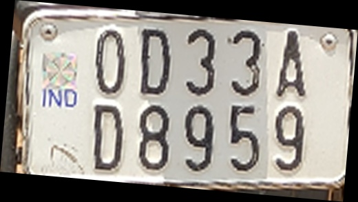

# ANPR(Automatic Number Plate Recognition)

This is my Bachelors degree project. an Automatic Number Plate Recognition (ANPR) system for specifically Indian vehicles using YOLOv8 and a custom CNN-based OCR model.

The system is optimized to perform OCR on 2-Row Indian HSRNs(High Security Number Plate).

The model detects 1-Row HSRNs(from Bikes) but to doesn't perform OCR correctly.

It doesn't detect Indian Green HSRNs(for EVS) at all.

---

## Prerequisites

Before starting, ensure you have the following installed on your system:

- **Python 3.x**: You can download Python from the [official site](https://www.python.org/downloads/).
- **pip**: Python package manager. It usually comes with Python, but you can verify it by running `pip --version`.

---

## Some things to Note

1. The license detection model is completely trained by me using YOLOv8 in Google Colab. You can check the `model_train` folder for the code. For the model train I used [Open Images Dataset V7](https://storage.googleapis.com/openimages/web/index.html) follow this [link](https://drive.google.com/file/d/1C1ztVZ0zVsS_yoLp-9QnN8N2_JWU5eHr/view?usp=sharing) to download the dataset used in this project.

2. The OCR Model & Implementation I used  is from the post [Characters Segmentation and Recognition for Vehicle License Plate](http://dangminhthang.com/knowledge-sharing/characters-segmentation-and-recognition-for-vehicle-license-plate/) by Minh Thang Dang(Thanks !!!).

---

## Important !!! Read it

When I implemented the project, I used **Windows** for the setup, with **TensorFlow for GPU v2.12** and **PyTorch on CUDA 11.8**, which did not conflict at all. However, if you try to install the current `tensorflow[and-cuda]` package, there will be a conflict. So, you **must set up two different environments** to run the project if you want to use the GPU for both **License Plate Detection** and **OCR**.

If you're using **CPU-only**, you do not need to do this.

---

## How to implement the code?

1. Make a Python virtual environment.
   1.Install virtualenv (if not already installed).
   ```code
   pip install virtualenv
   ```
   2.Create a Virtual Environment.
   ```code
   python -m venv <venv_name>
   ```
   3.activate virtualenv:
   ```code
   <venv_name>\Scripts\activate
   ```
2. Clone the Repo into it.

   ```code
   git clone https://github.com/bhubanesh-dev/anpr-YOLOv8-OCR.git
   ```

3. Check the **requirements.txt** file for installing required packages and run the code to install packages.

   ```code
   pip install -r requirements.txt
   ```

4. Download the character_model weight from [here](https://drive.google.com/file/d/151xr1iAcb0iKd58MlqRTw_gAf2zviHVx/view?usp=drive_link). Copy it to `weights/` directory.

5. In`/anpr` directory load images in `/input` and run `main.py` file .It will perform the detection of number plate and OCR on number plate For License Plate recognition. You can see the output in `anpr/results/` folder.

---

## Results
#### Load image in `/anpr/input`:

<p align="center">
  
</p>

#### Detected number plate:

<p align="center">
  
</p>

#### Cropped license plate:

<p align="center">
  
</p>

#### DeSkewed image:

<p align="center">
  
</p>

#### Clean Image:

<p align="center">
  
</p>

#### Grey Scale:

<p align="center">
  
</p>

#### Denoised:

<p align="center">
  
</p>

#### Otsu's Thresholding:

<p align="center">
  
</p>

#### Erosion & Dilation:

<p align="center">
  
</p>

#### Clean License Plate:

<p align="center">
  
</p>

#### Character Segmentation:

<p align="center">
  
</p>

#### Character Recognitions:

<p align="center">
  
</p>

---

I have also implemented a code for detection in Videos. You can the code check the folder `video_anpr`.Load the source video in `/video_anpr/test_samples` and run `video_test.py`.

#### Output Video

<video width="640" height="360" controls>
  <source src="https://drive.google.com/uc?id=1cBZ5U5i0zl0ETOJp36UY_QN9WbwfBZVz" type="video/mp4">
  Your browser does not support the video tag.
</video>
